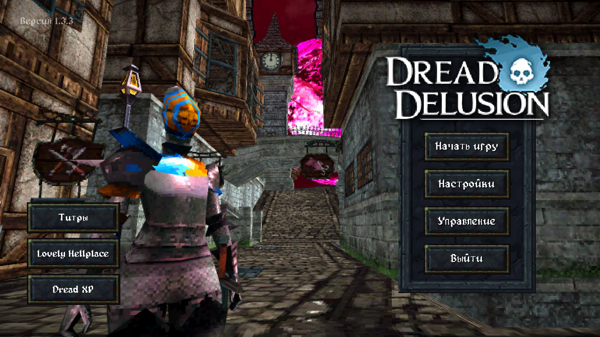
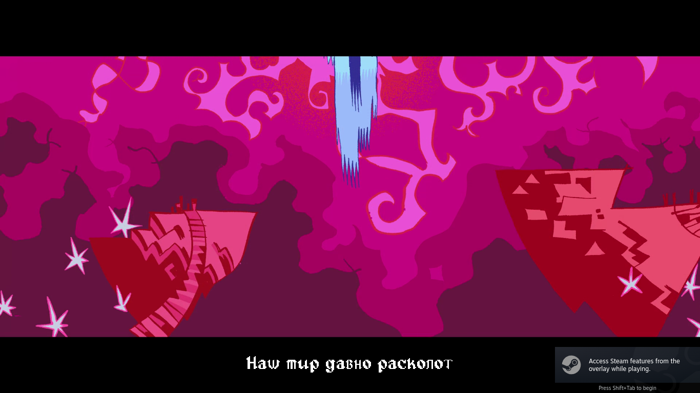
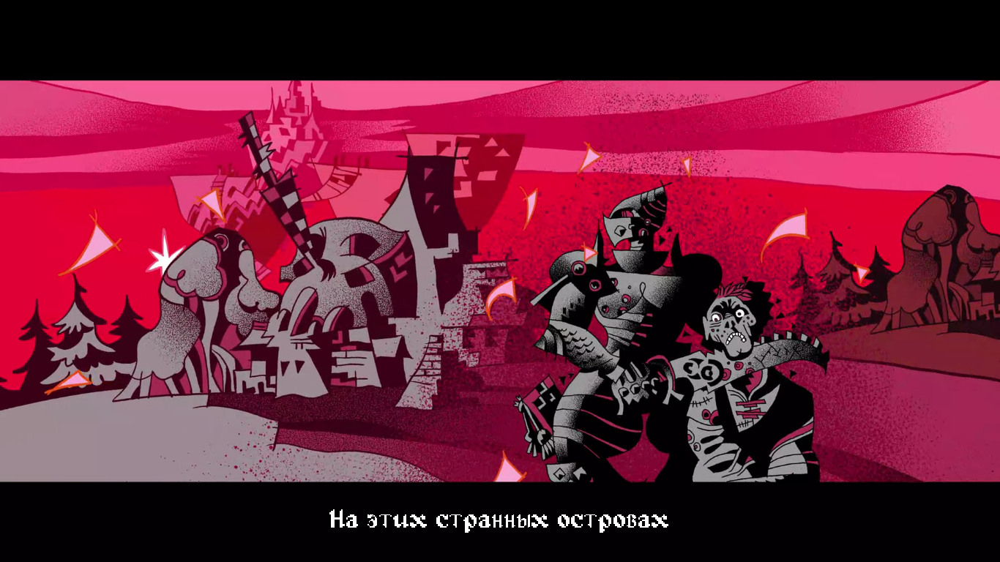
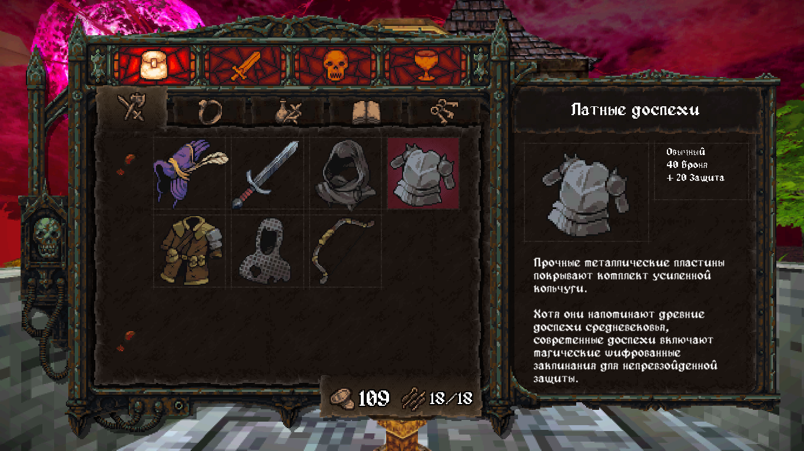
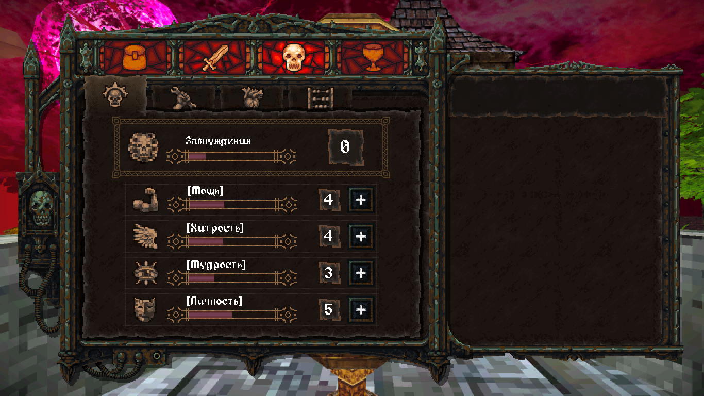
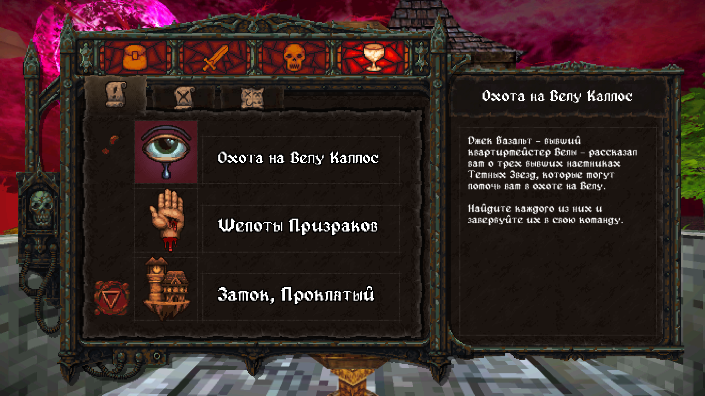
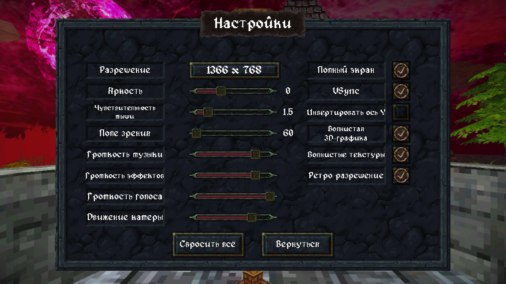
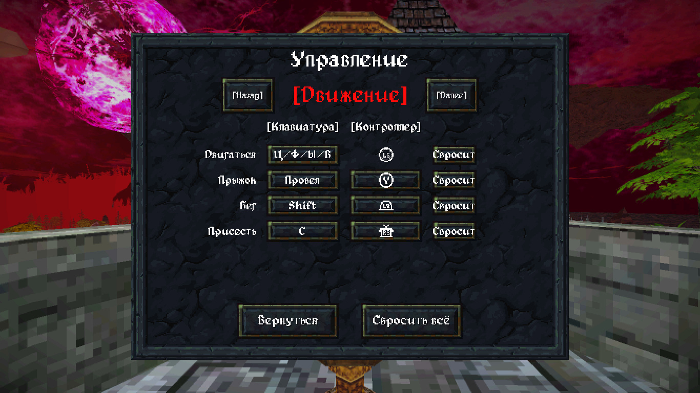

# Dread Delusion — русская локализация

Полный фан-перевод игры **[Dread Delusion](https://store.steampowered.com/app/1793630/Dread_Delusion/)** (Lovely Hellplace / DreadXP) на русский язык.

Для актуальной версии игры **1.3.3**. Переведено всё: диалоги, книги, квесты, интерфейс,
предметы, главное меню, субтитры вступительного ролика и титры. Кириллица отображается
фирменным пиксельным шрифтом игры (Alagard, кастомная кириллическая модификация).

## Установка

1. Откройте папку игры: в Steam — ПКМ по игре → **Управление → Посмотреть локальные файлы**.
2. **Сделайте резервную копию** файла `Dread Delusion_Data/resources.assets`
   (например, переименуйте в `resources.assets.bak`).
3. Скопируйте папку [`Dread Delusion_Data`](Dread%20Delusion_Data) из этого репозитория
   в папку игры **с заменой файлов**. Заменятся два файла:
   - `Dread Delusion_Data/resources.assets`
   - `Dread Delusion_Data/StreamingAssets/MenuText/menuText_en.json`
4. Запустите игру. В настройках ничего переключать не нужно.

Скачать всё разом: зелёная кнопка **Code → Download ZIP** вверху страницы.

⚠️ После обновления игры разработчиками перевод может слететь или перестать подходить
к новой версии — не обновляйте игру, пока здесь не появится совместимая версия перевода.

## Нашли ошибку?

Опечатка, непереведённый текст, вылезающий за рамки текст, кракозябры — **создайте
[Issue](../../issues)** (можно со скриншотом). Так я замечу проблему гораздо быстрее,
чем в комментариях к гайдам в Steam.

## Скриншоты

| | |
|---|---|
|  |  |
|  |  |
|  |  |
|  | |

## О переводе

- Перевод выполнен для версии игры на Unity 2019, затем полностью перенесён на
  актуальную сборку 1.3.3 (Unity 2022): тексты пересобраны под новую структуру ассетов,
  переведён новый контент (субтитры интро, управление дирижаблем и др.).
- Весь текст вычитан: единая терминология по глоссарию (~500 терминов), исправлены
  сотни ошибок и калек раннего перевода.
- Главное меню переведено впервые — в новой версии игры разработчики вынесли его текст
  в отдельный файл.
- Кириллический шрифт встроен в оба шрифтовых пути игры (обычный и TextMeshPro),
  метрики откалиброваны под оригинальную вёрстку.

## Благодарности

- **Lovely Hellplace** и **DreadXP** — за игру.
- Шрифт **Alagard** — Pix3M.
- Перевод, шрифты, портирование — [ring-rong](https://github.com/ring-rong)
  при участии Claude (Anthropic).

Перевод не является официальным. Все права на игру и её материалы принадлежат
правообладателям.
